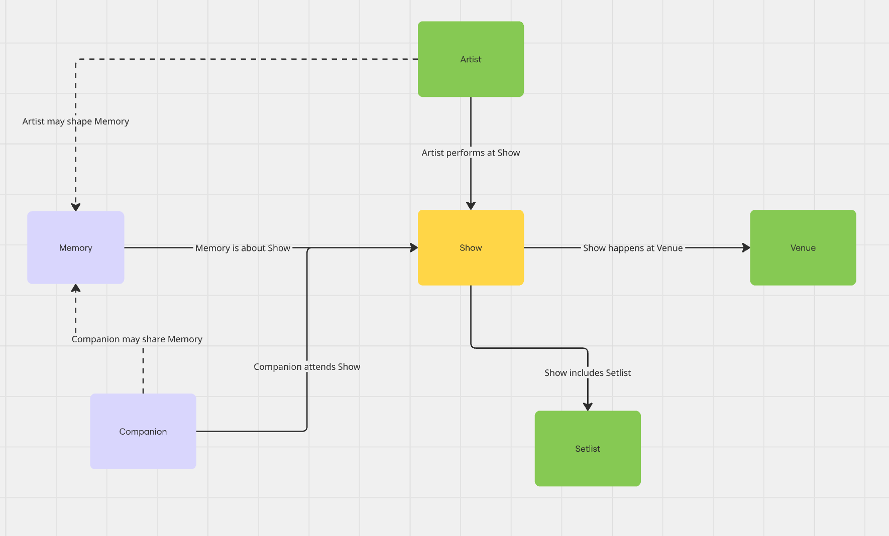

# Concert Memory Tracker

## Domain
Live Music / Concerts

## Motivation
Personally, I am a huge concert goer and have many scattered photos and videos of concerts that I never look back at. What I'm interested in is capturing the emotional and memorable side of concerts like where I went, who I saw, what was played, and what that moment meant to me. I want to capture this in a nostalgic scrapbook style.

## Problem It Solves
Current music and ticketing apps don't give much attention to preserving the experience of a live show as a meaningful personal memory. People may keep screenshots, photos, ticket PDFs, or notes in scattered places, but there is no simple way to connect the artist, venue, setlist, ticket, and personal memory into one organized experience.

## Key Features
- Track concerts a person has attended
- Organize each show by artist, venue, and date
- Preserve ticket information as part of the experience
- Record setlists from shows
- Attach personal memories or reflections to a concert
- Browse past shows as a timeline or archive

## Concepts
- **Show**: A live music event at a specific time and place.
- **Artist**: A musician or group that performs at a show.
- **Venue**: A location where a live show takes place.
- **Setlist**: The songs performed during a specific show.
- **Companion**: A person or group of people who attend a show together and share in the live music experience.
- **Memory**: A personal reflection or moment connected to a show.

I chose these concepts because they represent the parts of a concert experience that feel most meaningful to me. Instead of focusing only on music consumption, this model emphasizes the live event itself. **Show** is the central concept because it connects the performer, the location, the songs played, the people I went with, and the personal memory. I want to give more weight to the emotional side of live music that other apps typically ignore.

## Relationships
- Artist performs-at Show
- Show happens-at Venue
- Show includes Setlist
- Memory is-about Show
- Setlist belongs-to Show
- Companion attends Show
- Companion may-share Memory
- Artist may-shape Memory

